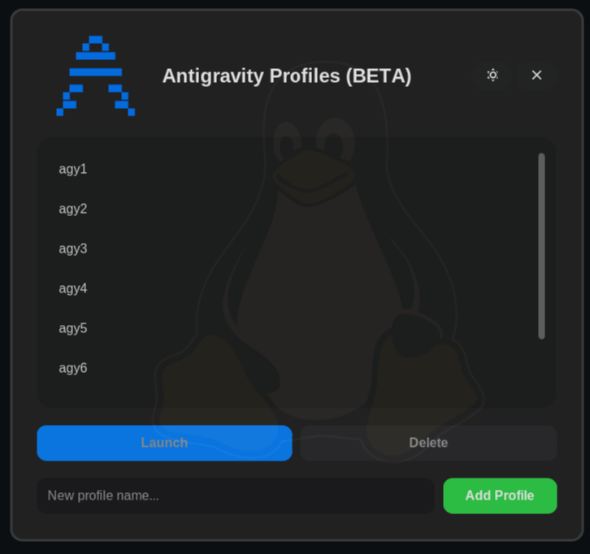
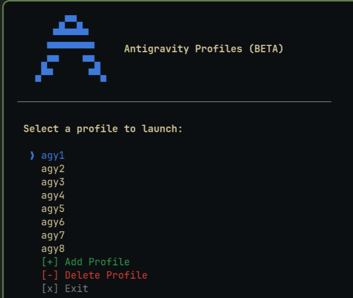

<div align="center">

<pre>
       ▄▀▀▄      
      ▀▀▀▀▀▀     
     ▀▀▀▀▀▀▀▀    
    ▄▀▀    ▀▀▄   
   ▄▀▀      ▀▀▄  
</pre>

# Antigravity Profiles

Manage multiple Antigravity accounts from one place — GUI and CLI both included.


</div>

---

I built this because I kept hitting usage limits mid-project and the only option was to manually log out, log back in with a different account, and lose my place. That got old fast.

## What it does

Keeps separate auth credentials for each "profile" (account). When you switch profiles, it swaps in that account's tokens and opens Antigravity — same app, same CLI, just a different login. Your history and `/resume` are tied to each account on Antigravity's servers, so nothing gets mixed up and nothing is lost.

Typical setup:

- `agy1` — main account, daily use
- `agy2` — backup for when agy1 hits limits
- `client` — separate account for client work

When agy1 hits a rate limit, open the tool, switch to agy2, keep going. When you come back to agy1 later, `/resume` picks up exactly where you left off.

---

## Screenshots

**GUI**



**CLI**



---

## Install

**Linux**
```bash
git clone https://github.com/pr4xh4r/agyp
cd agyp
bash install.sh
```

Handles Python environments including Arch/Debian where pip is restricted — creates a small venv if needed. Scripts are copied to `~/.local/share/agyp/` so the tool keeps working even if you move or delete the cloned repo.

**macOS**
```bash
bash install_mac.sh
```

Add `~/.local/bin` to your PATH if it isn't already:
```bash
echo 'export PATH="$HOME/.local/bin:$PATH"' >> ~/.zshrc
```

**Windows**

**Prerequisites (do these once, before anything else):**

1. **Install Python 3.8+** from [python.org](https://www.python.org/downloads/)
   > ⚠️ During the installer, check **"Add Python to PATH"** — this is critical!

2. **Install Git** from [git-scm.com](https://git-scm.com/download/win) (needed to clone the repo)

**Install:**

Open **Command Prompt** or **PowerShell** and run:

```cmd
git clone https://github.com/pr4xh4r/agyp
cd agyp
install.bat
```

> The installer copies scripts to `%LOCALAPPDATA%\agyp\` and automatically adds it to your PATH.

**After install, open a NEW terminal window**, then use either command from anywhere:

```cmd
agyp-cli
agyp-gui
```

**Or** without opening a terminal, just double-click from the cloned folder:
- `run-cli.bat` — opens the terminal profile manager
- `run-gui.bat` — opens the graphical profile manager

**Profiles are stored in:** `C:\Users\<you>\agyp-profiles\`

---

## Usage

**GUI**
```bash
agyp-gui
```

Pick a profile from the list, hit Launch. Add new profiles with the text box at the bottom. First time you use a new profile, Antigravity asks you to log in — after that the credentials are saved and it just works.

On **macOS**, a yellow "Save Credentials" button appears after launching the Desktop App. Click it once you're done with the session so your refreshed tokens are saved back to the profile.

On **Linux / Windows**, credentials are saved back automatically when the Desktop App closes.

**Custom App Paths:** If you installed the Antigravity Desktop App in a non-standard location, simply click the ⚙️ (Gear) icon in the GUI header to locate it. The CLI will also interactively prompt you for the path if it can't find `agy` automatically.

**CLI**
```bash
agyp
```

Arrow keys to navigate, Enter to select. Or go straight to a profile:
```bash
agyp agy1
agyp agy2
```

---

## How it works

Antigravity stores its auth in three files:
```
~/.gemini/antigravity-cli/antigravity-oauth-token   ← CLI account
~/.gemini/oauth_creds.json                          ← Desktop App account
~/.gemini/google_accounts.json                      ← Active account email
```

When you switch profiles, this tool swaps all three files simultaneously — so both the CLI and the Desktop App switch to the correct account instantly.

Profiles are stored in `~/agyp-profiles/`, one folder per profile. After each session, the refreshed tokens are automatically saved back.

---

## Requirements

- Python 3.8+
- `customtkinter` — installed automatically by the install script
- Antigravity CLI (`agy`) or Desktop App installed

The GUI works without Nerd Font — falls back to standard Unicode symbols automatically.

---

## Files

```
agyp_cli.py      — terminal interface
agyp_gui.py      — GUI (customtkinter, dark/light mode)
install.sh       — Linux installer
install_mac.sh   — macOS installer
install.bat      — Windows installer
run-cli.bat      — Windows CLI launcher
run-gui.bat      — Windows GUI launcher
assets/          — screenshots
```

---

## Notes

- Tested on Arch Linux, Ubuntu, Fedora, macOS Sonoma, Windows 11
- Safe to run over SSH — detects headless environments and won't crash
- Profile names are sanitized — path traversal and special characters blocked
- Your tokens stay in `~/agyp-profiles/` on your machine only — never uploaded anywhere
- After install, scripts live in `~/.local/share/agyp/` — moving the cloned repo won't break anything
