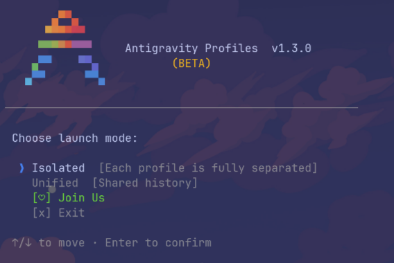
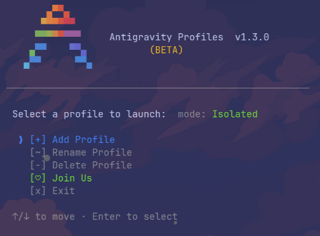

<div align="center">

<pre>
       ▄▀▀▄      
      ▀▀▀▀▀▀     
     ▀▀▀▀▀▀▀▀    
    ▄▀▀    ▀▀▄   
   ▄▀▀      ▀▀▄  
</pre>

# Antigravity Profiles (`agyp`) **BETA**

**Manage unlimited Antigravity (`agy`) accounts from a single terminal.**


 

</div>

---

## Why does this exist?

You are deep into a coding session with Antigravity (`agy`) and suddenly... **you hit the rate limit.** 
Normally, you'd have to log out, log into a different Google account, and lose your entire conversation history and context.

**Not anymore.** 

With `agyp`, you can create **unlimited profiles**. Hit a limit? Just open `agyp`, switch to your backup account, and keep coding. 

## Features

-  **Instant Account Switching:** Jump between work, personal, or backup accounts in seconds.
-  **Fully Isolated Sessions (Default):** Each profile gets its own separate history, workspace, and auth. Nothing leaks.
-  **Unified Mode:** Want to share your conversation history across different accounts? Unified mode swaps only the auth tokens.
-  **Beautiful Interactive TUI:** Flicker-free, arrow-key navigation. Add, rename, and delete profiles right from the terminal.
-  **Smart Labels:** Automatically displays the authenticated Google email next to each profile.
-  **Zero Dependencies:** Built in pure Python. Extremely lightweight and fast (~150ms startup).

---

## Installation

**Linux**
```bash
git clone https://github.com/pr4xh4r/agyp
cd agyp
bash install.sh
```

**macOS**
```bash
git clone https://github.com/pr4xh4r/agyp
cd agyp
bash install_mac.sh
```

> **Note:** If you see `agyp: command not found` after installing, ensure `~/.local/bin` is in your PATH. Add `export PATH="$HOME/.local/bin:$PATH"` to your `~/.bashrc` or `~/.zshrc`.

---

## Usage

Just run:
```bash
agyp
```
You'll be greeted by an interactive menu to choose your launch mode and select a profile. The first time you use a new profile, `agy` will ask you to log in. After that, it remembers you!

**Power User Shortcuts:**
- `agyp <profile_name>` — Bypass the menu and launch directly into a profile (Isolated mode).
- `agyp list` — View all saved profiles and their connected emails.
- `agyp rename <old> <new>` — Rename a profile quickly.

---

## Built by

Made by **[pr4xh4r](https://github.com/pr4xh4r)** — proud member of the **[Build x](https://x.com/buildx_main)** community.

Join us:
- ❯ X (Twitter): [x.com/buildx_main](https://x.com/buildx_main)
- ❯ Telegram: [t.me/buildx_main](https://t.me/buildx_main)
- ❯ Reddit: [r/buildx_main](https://reddit.com/r/buildx_main)
- ❯ Discord: [discord.gg/ShZRBUZ7AX](https://discord.gg/ShZRBUZ7AX)

## License

MIT © [pr4xh4r](https://github.com/pr4xh4r)
